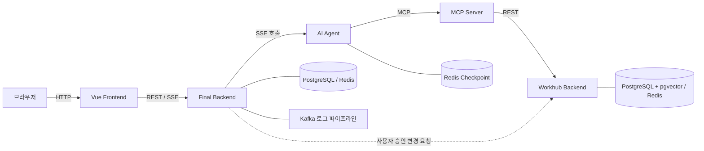

# Office-Link

Office-Link는 회의실, 방문객 주차, 구내식당, 사무용품, 사내 규정 업무를 하나의 대화 화면에서 조회하고 처리하는 사내 업무지원 AI 어시스턴트입니다. AI가 업무 의도와 필요한 정보를 정리하고, 사용자는 구조화된 Action Draft에서 최종 값을 확인한 뒤 변경 작업을 승인합니다.

## 핵심 기능

- 자연어 업무 요청과 SSE 기반 실시간 응답
- 회의실 예약, 방문객 주차 등록, 사무용품 신청의 조회·추천·최종 승인
- 부서와 역할 권한을 반영한 사내 규정 RAG 검색
- Hybrid Search와 BGE Re-ranker 기반 검색 결과 재정렬
- Azure SSO, JWT, OAuth2 Client Credentials 기반 사용자·서버 인증
- AOP/Decorator 로그를 메모리 배치, Kafka, 로그 테이블로 전달하는 관측 파이프라인
- Redis Checkpoint·장기 기억, 멱등성, 재시도, 빠른 실행 지원
- Agent 테스트 하네스와 4개 서버의 자동 테스트·커버리지 리포트

## 시스템 구성



| 디렉터리 | 역할 | 기술 |
| --- | --- | --- |
| `workspace-Final-Front` | 채팅, Action Draft, 관리자·마이페이지 UI | Vue 3, Vite, Pinia |
| `workspace-Final-Backend` | 사용자 인증, 채팅, SSE 중계, 최종 승인, 로그 집계 | Java 25, Spring Boot 3.5 |
| `workspace-Final-AI` | 의도 분석, 도메인 라우팅, Tool 선택, 답변 생성·검증 | Python 3.13, FastAPI, LangGraph |
| `workspace-mcp-server` | 업무 조회 Tool, Compact DTO, RAG 재정렬 | FastMCP, OpenVINO, BGE Re-ranker |
| `workspace-Workhub-Backend` | 업무·RAG 원장 API, Hybrid Search, 스케줄링 | Java 25, Spring Boot 3.5, pgvector |
| `deploy` | 전체 서비스와 데이터 저장소의 통합 실행 | Docker Compose, PowerShell |

각 애플리케이션은 독립 Git 저장소이며 이 저장소에서는 Git submodule로 고정된 배포 버전을 관리합니다.

## 사전 요구사항

- Windows 11과 PowerShell 5.1 이상
- Docker Desktop 및 WSL 2
- Git 2.40 이상
- Azure OAuth 애플리케이션 정보
- OpenAI API Key: 음성 인식과 RAG 임베딩에 사용
- OpenAI 호환 LLM API: OpenAI API 또는 유선 네트워크의 온프레미스 GPU 서버

서비스를 개별 실행하거나 테스트할 때는 Java 25, Node.js 22, Python 3.13이 추가로 필요합니다.

## 빠른 시작

### 1. 저장소 받기

```powershell
git clone --recurse-submodules <OFFICE_LINK_DEPLOY_REPOSITORY_URL>
cd final-project
```

이미 상위 저장소만 받은 경우:

```powershell
git submodule update --init --recursive
```

### 2. 환경변수 설정

```powershell
Copy-Item .\deploy\.env.example .\deploy\.env
```

`deploy/.env`에 Azure, OpenAI/온프레미스 LLM, OAuth 서명키, 서비스별 Client Secret, DB 비밀번호를 입력합니다. 실제 비밀값은 Git에 커밋하지 않습니다.

```powershell
.\deploy\start.ps1 -ValidateOnly
```

### 3. 전체 서비스 실행

```powershell
.\deploy\start.ps1
```

브라우저에서 [http://localhost](http://localhost)에 접속합니다. Kafka UI까지 실행하려면 다음 명령을 사용합니다.

```powershell
.\deploy\start.ps1 -WithOps
```

### 4. 종료와 재실행

```powershell
.\deploy\stop.ps1
.\deploy\start.ps1
```

`stop.ps1`은 Docker volume을 삭제하지 않으므로 PostgreSQL, Redis, Kafka 데이터와 Re-ranker 캐시는 유지됩니다. `deploy/.env`를 수정한 뒤에는 위 순서로 컨테이너를 다시 생성해야 변경값이 반영됩니다.

자세한 배포 옵션과 장애 해결은 [통합 배포 가이드](deploy/README.md)를 참고합니다.

## 온프레미스 GPU 서버 연결

발표 노트북과 GPU 서버를 같은 유선 네트워크에 연결하고 GPU 서버의 OpenAI 호환 API를 외부 인터페이스에 바인딩합니다.

```env
ONPREM_LLM_BASE_URL=http://<GPU_SERVER_IP>:11434/v1
ONPREM_LLM_API_KEY=<LOCAL_API_KEY>
PLAN_MODEL=<MODEL_NAME>
ACTION_MODEL=<MODEL_NAME>
RAG_VALIDATION_MODEL=<MODEL_NAME>
```

방화벽은 발표 노트북에서 해당 모델 API 포트로 들어오는 연결만 허용하는 것을 권장합니다. 모델 서버의 `/v1/models` 응답을 먼저 확인한 뒤 Office-Link를 실행합니다.

## 테스트와 품질 확인

4개 서버의 테스트와 커버리지를 한 번에 실행합니다.

```powershell
.\deploy\coverage.ps1
```

| 대상 | 테스트 | 커버리지 리포트 |
| --- | --- | --- |
| Final Backend | JUnit | `workspace-Final-Backend/build/reports/jacoco/test/html/index.html` |
| Workhub Backend | JUnit | `workspace-Workhub-Backend/build/reports/jacoco/test/html/index.html` |
| AI Agent | pytest | `workspace-Final-AI/build/coverage/html/index.html` |
| MCP Server | pytest | `workspace-mcp-server/build/coverage/html/index.html` |

Frontend 테스트는 별도로 실행합니다.

```powershell
cd .\workspace-Final-Front
npm ci
npm test
npm run build
```

Agent 하네스와 RAG 평가는 각각 [Agent 평가 가이드](workspace-Final-AI/evaluation/agent/README.md), [RAG 평가 가이드](workspace-mcp-server/evaluation/rag/README.md)를 참고합니다.

## 문서

- [통합 배포 가이드](deploy/README.md)
- [보안 정책](SECURITY.md)
- [변경 이력](CHANGELOG.md)
- [v1.0.0 릴리스 노트](docs/releases/v1.0.0.md)
- [Final Backend](workspace-Final-Backend/README.md)
- [Workhub Backend](workspace-Workhub-Backend/README.md)
- [AI Agent](workspace-Final-AI/README.md)
- [MCP Server](workspace-mcp-server/README.md)
- [Frontend](workspace-Final-Front/README.md)

## 라이선스와 사용 범위

교육 프로젝트와 내부 시연을 위한 저장소입니다. 조직의 Azure, OpenAI, 사내 문서 및 사용자 데이터를 사용할 때는 해당 조직의 보안·개인정보 정책을 함께 준수해야 합니다.
